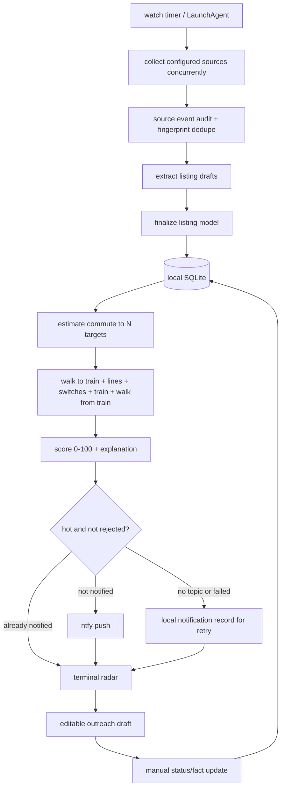

# Implementation Plan

This is the implementation plan for the terminal-first NYC Apt Radar loop.

## Current Stack

- Node + TypeScript.
- SQLite via `better-sqlite3`.
- Vitest.
- OpenAI Responses API call for unstructured listing-text extraction.
- Optional ntfy push notifications.
- No web app.

## Current Loop



The production boundary is simple: the loop can discover, score, notify, draft, and track. It never scrapes behind access controls, never bypasses CAPTCHA, and never sends outreach.

## Remaining Code Map

```text
src/config/          env loading, timeouts, ntfy setup helpers
src/core/            listing model, preferences, OpenAI extraction, finalization, geo, transit, scoring, ranking, outreach
src/discovery/       source loading, source collection, extraction, one-pass agent loop
src/storage/         SQLite schema and repositories
src/notifications/   ntfy push plus local notification records
src/diagnostics/     doctor/readiness checks
src/automation/      macOS LaunchAgent plist generation
scripts/             terminal commands
tests/               loop-level behavior tests
data/source-events/  real appointment source event
```

## What Should Stay

- The terminal-first loop and scripts.
- SQLite local persistence.
- Deterministic scoring and explanations.
- Source-event audit and notification dedupe tables.
- The small inspectable subway model until GTFS matters.
- OpenAI extraction as the only unstructured-text parsing path.
- Real appointment data in `data/source-events/appointment-leads.json`.
- Root planning docs: `PROMPT.md`, `SPEC.md`, `WORKFLOW.md`, `AGENTS.md`, `README.md`, this plan.

## What Should Go Or Stay Gone

- Deleted Next.js app, shadcn components, route handlers, Drizzle setup, design-system docs, fake UI flows, old parser fixtures, and duplicate seed paths should stay deleted.
- No fake listings should come back.
- No public marketplace, auth, Supabase, scraping automation, credentialed integrations, or auto-sending should be added.
- No new framework unless a later need clearly beats the terminal loop.

## Can It Get More Minimal?

Yes, but only in small PR-polish cuts:

1. Review scripts for overlap and merge only if it removes real cognitive load.
2. Keep `build` and `typecheck` as aliases for now because both are common reviewer commands.
3. Keep `src/core`, `src/discovery`, and `src/storage` separate; collapsing them would save files but make the loop less legible.
4. Consider dropping LaunchAgent generation only if background execution is no longer part of the MVP. Current spec says unattended watch matters, so keep it.
5. Keep OpenAI scoped to extraction. Do not add Agents SDK yet; this loop has deterministic orchestration and only needs model help for messy text.

## OpenAI Fit

The current OpenAI boundary matches the docs and the product spec:

- Use Responses API for unstructured source-text extraction.
- Use Structured Outputs through `text.format` with a JSON Schema.
- Set `store: false` for the private local workflow.
- Validate parsed output in application code before persistence.
- Handle refusals explicitly.
- Keep field finalization, ranking, scoring, source access, notifications, and outreach sending outside model control.

Docs checked:

- https://developers.openai.com/api/docs/guides/structured-outputs
- https://developers.openai.com/api/docs/guides/migrate-to-responses#incremental-rollout-checklist
- https://developers.openai.com/api/docs/guides/agents#choose-your-starting-point
- https://openai.com/index/harness-engineering/
- https://every.to/guides/compound-engineering

The harness-engineering lesson I want this repo to follow is: make the loop legible to the next agent run, keep repository knowledge local, and enforce taste through small executable checks. The compound-engineering lesson is: build a reusable local workflow that compounds rather than a one-off demo.

## Comment And Convention Pass

Do this before PR:

1. Keep TypeScript comments rare and explanatory.
2. Remove comments that restate code.
3. Keep CLI scripts direct and readable; no clever command framework.
4. Keep Markdown docs execution-oriented.
5. Preserve language-native constructs: TypeScript types for contracts, JSON examples for config, Mermaid only where it clarifies flow, shell snippets for commands.

## First PR Polish Slice

1. Run readiness and verification from the current state: done.
2. Add bounded concurrent source collection so one slow source does not serialize the rest: done.
3. Audit command names and README examples for drift: done.
4. Audit TypeScript comments and error messages: done.
5. Re-run the full command checklist: done.

## Execution Commands

```bash
npm install
npm run verify:loop
npm run reset
npm run discover
npm run radar
npm run doctor
npm run notify:test
npm run watch -- --once
npm run test
npm run typecheck
npm run build
git diff --check
```

Use `npm run ntfy:setup -- --write` first if `.env.local` does not already contain `NYC_APT_RADAR_NTFY_TOPIC`.

Do not run a live listing notification until the ntfy topic is intentionally subscribed and approved for apartment-detail pushes.

## PR Bar

- Repo remains smaller than the original web app.
- The loop works from real source-event data.
- The reviewer can understand the system from `SPEC.md`, `README.md`, and this plan.
- Tests and typecheck pass.
- OpenAI usage is optional, schema-constrained, and not used for judgment.
- No hidden live integration or automatic message sending exists.
