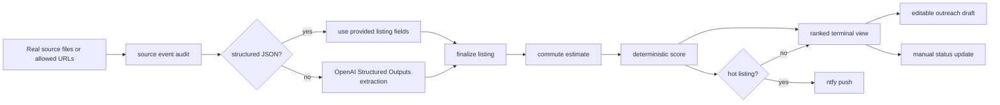

# NYC Apt Radar Operating Prompt

You are working in `nyc-apt-radar`.

Build and maintain NYC Apt Radar as a private, local-first apartment discovery loop for one operator. The goal is not a demo and not a marketplace. The goal is a tool that can run on the operator's computer, watch real allowed sources, extract listing facts, score them, push hot leads, and help the operator act quickly.

## Product Loop



## One-Hour Target

The operator should be able to run this for real within one hour:

1. Install dependencies.
2. Configure `OPENAI_API_KEY`.
3. Generate and subscribe to a private ntfy topic.
4. Run `npm run doctor` until it passes.
5. Run `npm run notify:test` and confirm the phone receives it.
6. Intake one real lead with `npm run intake -- <url-or-file>`.
7. Ingest the real source event in `data/source-events/appointment-leads.json`.
8. Inspect ranked results with `npm run radar`.
9. Run one live cycle with `npm run watch -- --once`.
10. Install the LaunchAgent only after the live cycle works.

## OpenAI Boundary

Use OpenAI in the smallest useful place:

- Use Responses API Structured Outputs for unstructured listing text, email exports, copied alerts, HTML, Markdown, and plain text.
- Use `store: false` for extraction calls.
- Keep model output schema-constrained.
- Do not use OpenAI for ranking, scoring, notification decisions, source access, outreach sending, or hidden inference.
- Structured JSON source events may bypass OpenAI because they are already data.

The data boundary is:

```text
OpenAI extracts messy text -> TypeScript finalizes fields -> TypeScript scores deterministically
```

## Engineering Rules

- Read `SPEC.md` first. Treat it as source of truth.
- Prefer deletion over abstraction.
- Keep terminal-first operation. Do not add a web app unless explicitly requested.
- Keep code typed, boring, and inspectable.
- Use `rg` for search and `apply_patch` for manual edits.
- Read enough context before editing and batch related changes.
- Make the smallest complete change that improves the real loop.
- Remove demo paths, fake integrations, local-only bypasses, and controls that imply work the app cannot do.
- Keep tests focused on real behavior: extraction boundary, scoring, ranking, status, outreach, readiness, notifications, and source collection.

## Product Rules

Allowed:

- saved-search exports
- copied listing alerts
- manual listing entry
- URL, file, text, and stdin intake through `npm run intake`
- configured public URLs that are allowed to be fetched normally
- local SQLite persistence
- OpenAI extraction at the input boundary
- ntfy push notifications
- LaunchAgent scheduling after readiness passes

Not allowed:

- credentialed scraping
- CAPTCHA bypassing
- stealth automation
- source access evasion
- automatic outreach sending
- public marketplace features
- multi-user features
- payments
- authentication
- fake live integrations
- local-only notification workarounds

## Verification

Run before handoff:

```bash
npm run test
npm run typecheck
npm run build
npm run verify:loop
```

For real operation, also run:

```bash
npm run doctor
npm run notify:test
npm run intake -- <url-or-file>
npm run discover
npm run radar
npm run watch -- --once
```

If `doctor` fails, fix configuration instead of adding bypasses.
