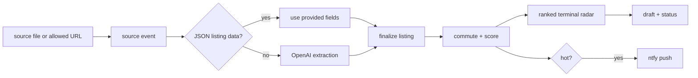

# NYC Apt Radar

NYC Apt Radar is a private, local-first apartment discovery loop for a New York City search. It watches real allowed sources, extracts listing facts with OpenAI when the input is messy, finalizes fields locally, estimates subway commute quality, scores and ranks listings, sends ntfy push notifications for hot leads, drafts outreach, and tracks status.

It is not a web demo, marketplace, scraper, CAPTCHA bypasser, stealth browser, CRM, payment app, or automatic message sender.



## Get It Working In The Next Hour

Install dependencies:

```bash
npm install
```

Create real local configuration:

```bash
npm run ntfy:setup -- --write
```

Then edit `.env.local` and add:

```bash
OPENAI_API_KEY=your-openai-api-key
```

Subscribe to the generated ntfy topic in the ntfy app, then run:

```bash
npm run doctor
npm run notify:test
npm run reset
npm run intake -- https://streeteasy.com/building/345-west-30-street-new_york/4b
npm run discover
npm run radar
npm run listing:draft -- 345-w-30th-st-4b
npm run watch -- --once
```

`doctor` must pass before the unattended loop is real. It checks SQLite, preferences, sources, OpenAI, ntfy, and watch interval. `notify:test` must reach your phone.

After the one-shot watch works, install the macOS LaunchAgent:

```bash
npm run watch:plist -- --write
launchctl unload ~/Library/LaunchAgents/com.nyc-apt-radar.loop.plist 2>/dev/null || true
launchctl load ~/Library/LaunchAgents/com.nyc-apt-radar.loop.plist
launchctl start com.nyc-apt-radar.loop
npm run logs
```

## Intake

Use `intake` when you have something in front of you and want it in the radar now:

```bash
npm run intake -- https://streeteasy.com/building/...
npm run intake -- --file listings.txt
npm run intake -- --text "paste listing text"
pbpaste | npm run intake
```

If a file contains only URLs, one per line, each URL is intaken separately.

For URLs, the tool tries normal public HTTP fetch first. If the page blocks plain access or cannot be read, the tool saves a URL-only lead with the source link intact instead of bypassing source controls. Paste listing text or export files when you want OpenAI to fill more fields.

For pasted text, email exports, HTML, Markdown, and other unstructured files, `intake` uses OpenAI Structured Outputs, saves the extracted listings, scores them, and prints the next action plus draft command.

## Watched Sources

The default watched source directory is:

```text
data/source-events
```

The repo includes one real structured source event:

```text
data/source-events/appointment-leads.json
```

To add listings, place `.json`, `.txt`, `.eml`, `.html`, or `.md` files in `data/source-events`, then run:

```bash
npm run discover
```

Structured JSON source events are passed through and finalized locally. Unstructured text, email, HTML, and Markdown require `OPENAI_API_KEY` and are extracted with OpenAI Structured Outputs.

To configure additional real sources, create `data/sources.json` with directory, file, or public URL entries that you are allowed to fetch with plain HTTP. You can also set `NYC_APT_RADAR_SOURCE_URLS` in `.env.local` to a comma-separated list of real public URLs.

If a source fails, the loop records the failure and continues processing other reachable sources. It does not bypass source controls.

## Commands

```bash
npm run doctor
npm run verify:loop
npm run intake -- https://streeteasy.com/building/...
npm run intake -- --file listings.txt
npm run discover
npm run radar
npm run listing:add -- --title "New lead" --rent 3995 --source-url "https://..."
npm run listing:update -- 56-ainslie-st-4g --pets cats_allowed --fee-status no_fee --notes "Broker confirmed cats."
npm run listing:status -- 56-ainslie-st-4g interested
npm run listing:draft -- 56-ainslie-st-4g
npm run listing:extract -- "paste listing text"
npm run notify:test
npm run notifications
npm run sources
npm run watch -- --once
npm run watch:plist -- --write
npm run logs
npm run reset
```

OpenAI-assisted extraction:

```bash
npm run listing:extract -- "paste listing text"
cat listing.txt | npm run listing:extract -- --save
```

`listing:extract` prints or saves raw OpenAI extraction output. Prefer `intake` for normal use because it records the source event, saves listings, scores them, and prints the next action.

## Scoring

Scores are deterministic from 0 to 100:

- price fit: 25
- location fit: 20
- commute fit: 20
- apartment fit: 15
- pet fit: 10
- freshness: 5
- completeness/confidence: 5

Unknown fields lower confidence and score. They do not automatically reject a listing. Explicit dealbreakers cap the score.

## Preferences

The default profile lives in `src/core/preferences.ts`. For local configuration, create `data/preferences.json` from `data/preferences.example.json`, then set:

```bash
NYC_APT_RADAR_PREFERENCES_PATH=data/preferences.json
```

The profile supports budget, neighborhoods, commute targets, bedroom and bathroom preferences, pet requirements, fee preference, dealbreakers, nice-to-haves, and the hot-score threshold.

## Notifications

Hot listings are pushed through ntfy. Missing ntfy configuration is a failed readiness check. Delivery failures are recorded in SQLite and retried on the next run for the same listing score.

Use:

```bash
npm run notify:test
npm run notify:test -- --listing 345-w-30th-st-4b
npm run notifications
```

## Storage

Local SQLite data is stored at:

```text
data/nyc-apt-radar-loop.sqlite
```

Reset it with:

```bash
npm run reset
```

## Out Of Scope

- credentialed scraping
- CAPTCHA bypassing
- stealth automation
- source access evasion
- automatic message sending
- public marketplace features
- multi-user features
- payments
- authentication
- sensitive document storage
- native mobile app
- decorative web UI
