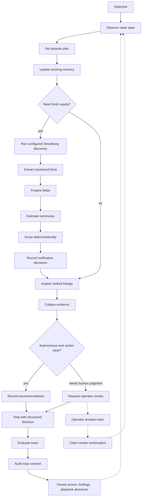
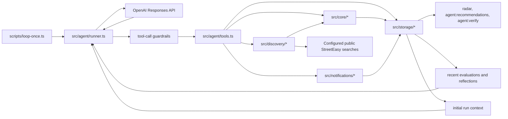
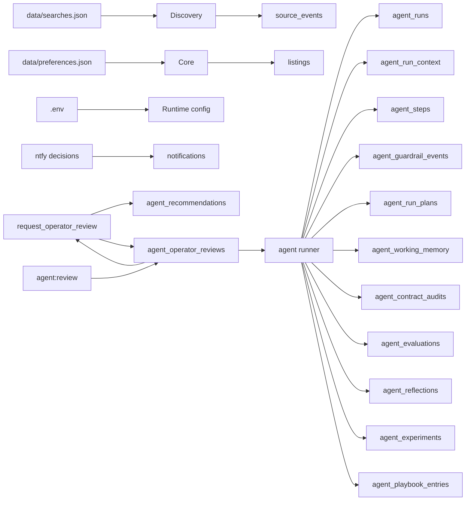

# SYSTEM_DESIGN.md - NYC Apt Radar

## Product Contract

NYC Apt Radar runs one focused use case:

```text
Given an operator preference profile and configured StreetEasy search URLs,
run a bounded OpenAI-supervised discovery pass that finds apartments, scores them,
notifies on hot matches, records evidence-backed next actions or human-review requests, reflects on the run,
evaluates the episode, and feeds compact playbook directives into the next run.
```

The product is not manual listing intake, an in-app scheduler, a deployment framework, a generic real estate app, or a scraping experiment. Those paths add surface area without improving the main loop. VPS support is limited to plain systemd examples that run the same terminal command.

## Main Loop



## Components



## Agent Semantics

This is an agent loop because the model controls the process:

- It receives an objective and a bounded tool set.
- It must gather state through tools before acting.
- It records a typed episode plan with success criteria, planned steps, stop conditions, risk checks, and confidence.
- It maintains explicit working memory for focus, hypotheses, next actions, open questions, and confidence.
- It chooses whether to discover, inspect, draft, review failures, recommend, or stop, and every tool call declares intent.
- It sees tool outputs and uses them to decide the next step.
- It takes one tool action per model turn so each next action can be conditioned on fresh tool feedback.
- It blocks extra tool calls in the same model turn before side effects can happen.
- It persists the initial run context so memory, experiments, audits, and human-review continuations are auditable.
- It turns any active experiment into an episode constraint by reflecting it in the plan or working memory.
- Runtime guardrails allow, rewrite, or block proposed tool calls before execution.
- A run-local evidence ledger tracks which listing ids were observed or inspected, so recommendations can only refer to evidence the supervisor actually saw during the episode.
- It can request structured operator review when a decision depends on human judgment instead of model autonomy.
- It claims one answered or dismissed blocking operator review as explicit continuation state in a later run.
- It stops with a structured decision that reports outcome, criterion results, next actions, unresolved questions, and summary.
- It audits each episode locally against a deterministic minimum loop contract.
- It evaluates each episode through a strict `record_episode_evaluation` function call and carries compact scores, findings, lessons, and a concrete next experiment into later runs.
- It rejects malformed critic output instead of filling missing lessons, experiments, or playbook directives with defaults.
- It distills each evaluated episode into durable playbook directives that future runs receive before planning.

It is not a free-form web-browsing agent. The model does not fetch arbitrary sites, bypass access controls, extract unsupported facts, send outreach, or mutate listing status. The model controls orchestration; typed services control truth and side effects.

## Tool Boundary

| Tool | Purpose | Side effects |
| --- | --- | --- |
| `get_radar_state` | Read current counts, rankings, recommendations | none |
| `update_working_memory` | Persist current focus, hypotheses, next actions, open questions, and confidence | working-memory revision |
| `set_episode_plan` | Persist objective, success criteria, planned steps, stop conditions, risk checks, and confidence | episode-plan record |
| `run_discovery_pass` | Fetch configured StreetEasy searches and run deterministic extraction/scoring | source events, listings, notification decisions |
| `inspect_listing` | Read one listing with score and commute context | none |
| `draft_outreach` | Generate a human-editable draft | none |
| `inspect_recent_failures` | Read failed source and notification records | none |
| `request_operator_review` | Persist one precise human-review question with bounded options, a recommended option, rationale, evidence, and blocking flag | operator review request only |
| `record_recommendation` | Persist the supervisor's next action with structured evidence | recommendation only |
| `stop_agent` | End the loop with outcome, criterion results, next actions, unresolved questions, and summary | run status |

Recommendations and operator review requests are not free-form assertions. Both tools require evidence objects copied or summarized from prior tool outputs. Listing-specific writes must cite their listing id and are enriched with deterministic listing, score, and source evidence before persistence.

Operator review is a real feedback loop, not a dead-end note. The local operator answers or dismisses a review through `npm run agent:review`; the next run claims one resolved blocking review as continuation state and injects the question, selected option or dismissal, operator note, source run id, and evidence into the first model prompt. `get_radar_state` also exposes recent review status, selected option, operator note, resolution time, and resume linkage to future model episodes.

The runner also maintains an in-run evidence ledger. `get_radar_state`, `run_discovery_pass`, `inspect_listing`, `draft_outreach`, and failure inspection can add observed listing ids. `inspect_listing` adds inspected listing ids. Listing-specific `record_recommendation` and `request_operator_review` calls are blocked unless the listing id was observed earlier in the same run; outreach and status recommendations are blocked unless that listing was inspected earlier in the same run.

The contract audit checks causal ordering, not just artifact presence. It fails when a model turn batches multiple tool calls before feedback, records a plan before any successful observation, writes operator-facing output before post-observation working memory, or stops before plan and memory have shaped the decision.

The contract audit also checks experiment attention. If a run starts with an active experiment, the experiment must appear in the episode plan or working memory; simply carrying it in the prompt is not enough.

## Guardrail Boundary

The model proposes tool calls; the runtime arbitrates them before execution.

- `allowed`: execute as requested.
- `rewritten`: execute with policy-safe effective arguments and return guardrail feedback to the model.
- `blocked`: do not execute; return a blocked tool result so the model can adapt.

Every guardrail decision is persisted in `agent_guardrail_events`. Today the main rewrite is live notification protection: if a dry run asks to send ntfy notifications, the runtime rewrites that discovery call to `dry-run` and makes the rewrite visible in the tool result. Provenance failures are blocks: the model receives the blocked tool result and can adapt by observing or inspecting the listing first.

Batched tool calls are also blocks. If a model response contains more than one tool call, the runtime executes only the first call and returns blocked tool results for the rest, preserving protocol feedback without allowing multiple side effects before observation.

## Data Boundary



SQLite is an audit and memory store, not the product thesis. It exists so every listing, source event, notification decision, initial run context, tool call, episode plan, working-memory update, guardrail decision, model recommendation, operator review request, review continuation, contract audit, episode evaluation, active experiment, playbook directive, and run reflection is inspectable.

The experiment cycle is the lightweight self-improvement loop. The critic turns each episode's `nextExperiment` into a pending experiment. The next run claims that experiment, receives it in the first model prompt, and must operationalize it in the episode plan or working memory. The critic marks it succeeded, failed, or skipped from the trace before creating the following experiment.

The playbook cycle is the durable behavior loop. The critic turns lessons, audit failures, and operator feedback into typed directives: `policy`, `heuristic`, `anti_pattern`, or `operator_preference`. Active directives are injected into the next run before the supervisor sets an episode plan.

Critic output is strict product data. If the evaluator omits required scores, findings, reflection fields, experiment result, next experiment, or playbook updates, the run records the evaluator error and the contract audit fails evaluation and playbook learning. The runtime does not invent learning artifacts to make the loop look healthy.

## Verification Boundary

`npm run agent:verify` is a read-only evidence check over the latest completed run. It fails unless persisted state proves the loop shape: OpenAI model supervisor, persisted initial run context, balanced model/tool/final trace, adaptive-loop causality, guardrail decisions, active-experiment attention when applicable, passing contract audit, episode evaluation, reflection, durable playbook directive, and experiment-loop state.

## What Was Cut

- Manual URL/file/stdin intake as a product path.
- Listing CRUD commands as the primary way to drive the system.
- launchd/systemd installers and log commands. Static systemd example units remain for VPS use.
- Deterministic fallback mode for the main loop.
- Scheduler commands or deployment installers.

The remaining system has one center: `npm run agent:run`, with `npm run agent:dry-run` for safe notification-skipping runs.
